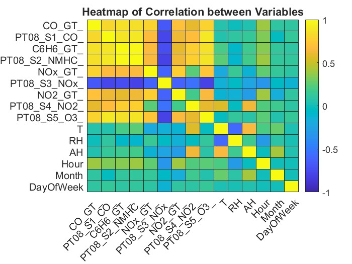
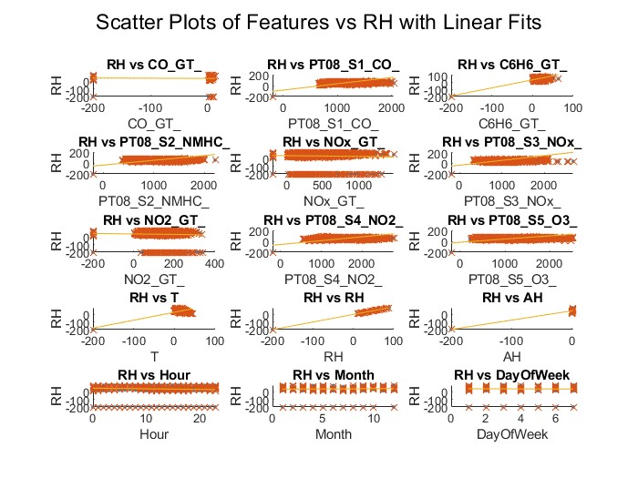
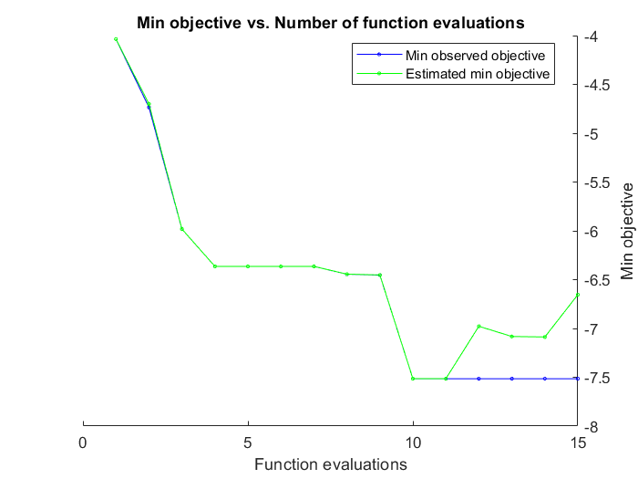
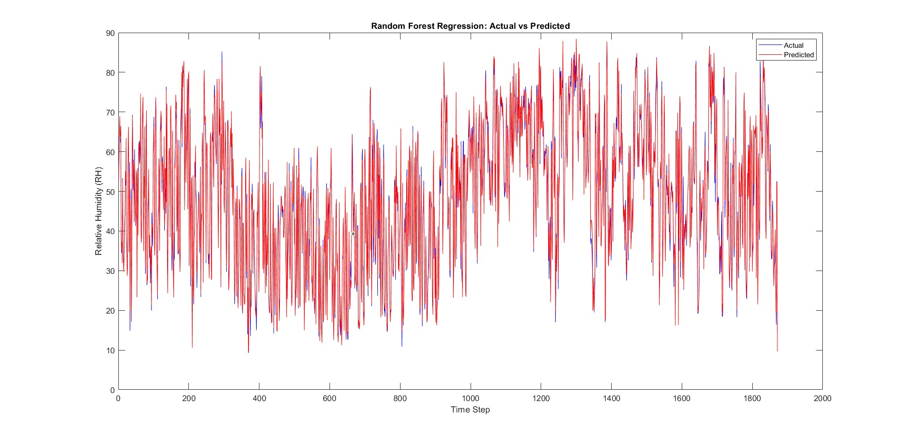

# Air-Quality-ML-prediction

# 🌍 Air Quality Prediction using Machine Learning

## 📌 Overview

This project develops a machine learning pipeline to predict Relative Humidity (RH) using air quality sensor measurements.

The study investigates how environmental pollutants and temporal factors influence humidity and evaluates multiple regression models to identify the most effective approach.

## 🚀 Key Highlights

End-to-end machine learning pipeline in MATLAB

Time-aware missing value imputation

Feature engineering using temporal data

Comparison of multiple regression models

Bayesian optimization for model tuning

---

## 📊 Dataset

The dataset contains air quality measurements including:

* Date:	The date of the measurement.
* Time:	The time of the measurement.
* CO(GT):	Concentration of carbon monoxide (CO) in the air (µg/m³).
* PT08.S1(CO):	Sensor measurement for CO concentration.
* NMHC(GT):	Concentration of non-methane hydrocarbons (NMHC) (µg/m³).
* C6H6(GT):	Concentration of benzene (C6H6) in the air (µg/m³).
* PT08.S2(NMHC):	Sensor measurement for NMHC concentration.
* NOx(GT):	Concentration of nitrogen oxides (NOx) in the air (µg/m³).
* PT08.S3(NOx):	Sensor measurement for NOx concentration.
* NO2(GT):	Concentration of nitrogen dioxide (NO2) in the air (µg/m³).
* Temperature (T)
* Relative Humidity (RH) → **Target variable**

### ⚠️ Important

Missing values are represented as **-200**

---

## ⚙️ Methodology

### 🔹 1. Data Preprocessing

#### Data Cleaning

* Converted string values with commas to numeric format
* Ensured all features are usable for computation

#### Time Feature Engineering

* Extracted:

  * Hour
  * Month
  * Day of Week
* Enables capturing temporal patterns in air quality

#### Missing Value Handling

* Missing values (-200) replaced using **hourly mean imputation**
* Preserves time-dependent environmental behavior

#### Feature Reduction

* Removed **NMHC(GT)** due to excessive missing values

---

### 🔹 2. Exploratory Data Analysis

* Correlation matrix used to analyze relationships between variables
* Heatmap visualization for feature interactions
  
* Scatter plots with linear fits used to study relationships with RH
  

---

### 🔹 3. Modeling Approach

#### Linear Regression

* Used as a baseline model
* 10-fold cross-validation applied
* Chosen for interpretability and simplicity

#### Decision Tree Regression

* Captures non-linear relationships
* Configured with:

  * MinLeafSize = 3
  * MinParentSize = 1
  * Curvature-based splitting

#### Optimized Decision Tree

* Hyperparameters tuned using **grid search**
* 3-fold cross-validation for robustness

#### Random Forest Regression

* Ensemble model using LSBoost
* Hyperparameters optimized using **Bayesian Optimization**
* 

---

## 📈 Results

### 🔹 Model Performance Comparison

| Model                     | Training RMSE | Test RMSE |
| ------------------------- | ------------- | --------- |
| Linear Regression         | 5.845         | 5.856     |
| Decision Tree             | 0.524         | 5.402     |
| Optimized Decision Tree   | 0.783         | 7.517     |
| Random Forest (Optimized) | **0.406**     | **1.976** |

---

### 🔹 Key Observations

* Linear Regression provides a stable but limited baseline
* Decision Tree captures non-linear patterns but shows slight overfitting
* Grid Search did not improve generalization significantly
* Random Forest achieves the **best performance and generalization**

---

## 📷 Visualization

### Model Prediction Plot



---

## 🧠 Key Learnings

* Environmental data exhibits **complex non-linear relationships**
* Time-aware imputation significantly improves data quality
* Tree-based models outperform linear models
* Ensemble methods provide the most reliable predictions

---

## ⚙️ Design Decisions

* Hourly mean imputation preserves temporal dependencies
* Temporal features improve model performance
* Ensemble learning chosen for robustness and accuracy

---

## 🚀 How to Run

1. Download dataset (see `data/README.md`)
2. Place it in:

```
data/AirQualityUCI.csv
```

3. Run:

```matlab
air_quality_prediction
```

---

## 🔮 Future Work

* Explore Neural Network / Transformer-based models
* Improve feature selection techniques
